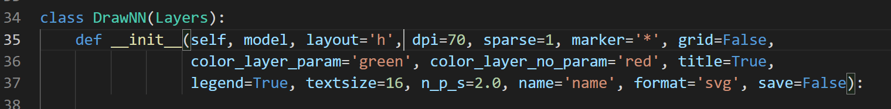

# Visualize your Model ! ╰(*°▽°*)╯    ( ´･･)ﾉ(._.`) 
 

   

   

## First create a model or load an existing model, then import Class DrawNN from nn_plot. Just pass your model (rest of the arguments are keyword arguments). { The model I created here does not make any sense and also not appropriate for constructing the NN model, this is only for testing the robustness of the module }.
 

# or
<!--   -->

## This module supports the following layer ( for now) :
- MaxPooling2D
- Conv2D
- Flatten
- InputLayer
- Dense
- Sequential
- Activation
- Dropout
  

## Approach :  
    We know that every layer has unique functionality and parameters that defines them like poll_size ,units , activation , kernel_size , strides , rate (in dropout) and many others. So, I created a class which has dedicated methods for each kind of layer and returns the desired info about that particular layer. 

    I put the layers which I know about and also use most of the time, I know there are many other different types of layers like RNN , SpatialDropout2D , LSTMCell and many other but as I told you I don't have expertise on these layers, So if you have, then fork this repo and suggest changes or updates

## Methods and Parameters
- create_graph: method to draw the graph and save it
- layout: specifies horizontal('h') or vertical('v'), default layout='h', if no. of layers is  less but no. of neurons are large (atleast in one layer, like 150 or more) choose 'h', and for contrary condition choose 'v'

- grid (bool):whether display axes or not,default=False

- model: your tensorflow model

- dpi (int): dpi of the plot (plt.figure(figsize=(20,16),dpi=self.dpi)) , for large model choose dpi between 30-40, for smaller model choose dpi between 70-80 , default=70

- legend,title (bool): whether display legend or title, default= True,True

- color_layer_param,color_layer_no_param (str): colors of layer with parameter(weights and biases) and color of layers with no parameters

- marker (str): type of marker, ex: '1' , '*' , '$py$'

- textsize (int): size of layer names and legend

- sparse (int): if makers are overlapping, sparse reduces the no. of markers of each layer by the given factor,default=1

- n_p_s (int): size of neuron(marker) with parameters,default=2

### create_graph method also saves the graph in 'png' , 'pdf' and 'svg' format, it takes three more keyword arguments -

- save (bool): bool, default=False
- name (str):  for file name, not extension, default='name'
- format (str): 'png', 'pdf' and 'svg', default='svg'
   

## Default Parameters

   

## In the above plot, markers are overlapping ,so after changing sparse from value 1 to 4 (which reduces the markers in each layer by 4 ), we get the following figure

    

## In above plot, the model is large so we decrease the dpi to value 45 ,and in following plot we have a small model so we used value 75 for dpi.
